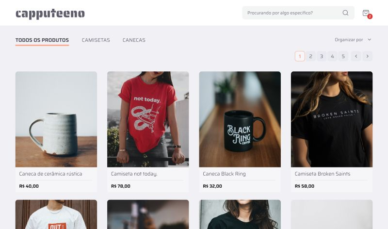

# capputeeno

This is a solution for Rocketseat's [Front end challenge](https://github.com/Rocketseat/frontend-challenge)

# 🧠 Context



The challenge is to implement an e-commerce for selling mugs and t-shirts that should have the following features:

- [x] Product catalog with pagination
- [x] Filtering products by category
- [x] Search by product name
- [x] Add and remove products from cart
- [x] Checkout

## 🖥️ Running the project

Clone the project

```bash
  git clone https://github.com/adiel-calixto/frontend-challenge
```

Go to the project directory

```bash
  cd frontend-challenge
```

### With Docker

```bash
  docker compose up
```

### Without Docker

#### Running the frontend

Go to the project directory

```bash
  cd frontend
```

Copy the configuration

```bash
  cp .env.example .env.local
```

Install dependencies

```bash
  yarn
```

Start the development server

```bash
  yarn dev
```

#### Running the API

Go to the project directory

```bash
  cd api
```

Install dependencies

```bash
  yarn
```

Start the server

```bash
  yarn start
```
